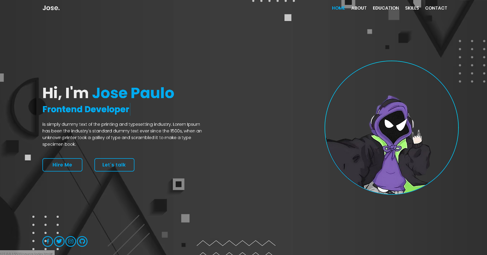

# Personal Portfolio

This is a simple personal portfolio template to showcase your information and projects. The portfolio is built using HTML, CSS, and JavaScript and includes smooth scrolling animations and a contact form with email validation.



## Demo

- See a live demo of the portfolio [here](./source/img/screenshots/projeto.gif).

## Contents

- [Project Structure](#project-structure)
- [How to Use](#how-to-use)
- [Customization](#customization)
- [License](#license)

## Project Structure

- The project structure is organized as follows:

- `index.html`: Contains the HTML structure of the portfolio.
- `style`: Contains the portfolio's style files.
    - `global.css`
    - `style.css`
- `js`: Contains JavaScript scripts for animations and form validation.
    - `script.js`
- `img/`: Folder that should contain the images used in the portfolio.
- `screenshots/`: Folder that can contain screenshots of your portfolio.

## How to Use

1. Clone this repository to your computer:

   ```bash
   git clone https://github.com/joseook/portfolio-basic.git
   ```

2. Navigate to the project folder:

   ```bash
   cd portfolio-basic
   ```

3. Open the `index.html` file in your web browser to view your personal portfolio.

## Customization

- You can customize the portfolio in the following ways:

### Content

- Open the `index.html` file and replace the content with your personal information and projects.
- Add or remove sections as needed.

### Styles

- Customize the portfolio's style by editing the `style.css` file. You can change colors, fonts, sizes, and more to suit your personal taste.

### Images

- Replace the images in the `img/` folder with your own images. Make sure to keep the file names and update references in the HTML files if necessary.

### Contact Form

- The contact form is set up to send messages using the Formspree service. To customize the form, follow the instructions in the [Formspree documentation](https://formspree.io/documentation).

## License

This project is licensed under the MIT License - see the [LICENSE](LICENSE) file for details.

## Notes

This project is for educational purposes.

